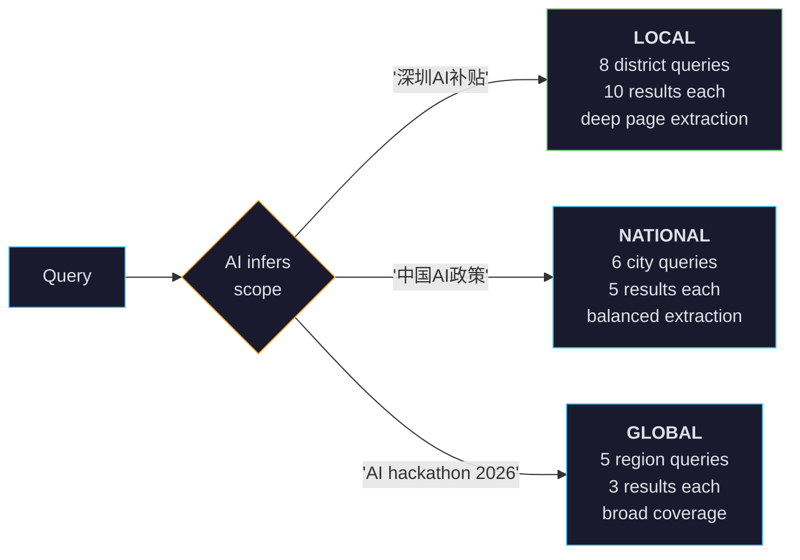

<h1 align="center">
  MoleMiner
</h1>

<h4 align="center">You search once. It researches for you.</h4>

<p align="center">
  <a href="https://www.npmjs.com/package/moleminer"></a>
  <a href="https://github.com/Leooo-Huang/MoleMiner/actions"></a>
  
  
  <a href="LICENSE"></a>
</p>

<p align="center">
  <a href="#the-problem">The Problem</a> &#8226;
  <a href="#how-it-works">How It Works</a> &#8226;
  <a href="#quick-start">Quick Start</a> &#8226;
  <a href="#web-ui--3d-globe">Web UI</a> &#8226;
  <a href="#adaptive-search-scope">Adaptive Scope</a> &#8226;
  <a href="#sources">Sources</a> &#8226;
  <a href="#commands">Commands</a>
</p>

---

<!--
<p align="center">
  
</p>
-->

## The Problem

You Google something. Click 5 links. Realize you need to search again with different words. Repeat. An hour later you have 20 tabs and no clear picture.

**MoleMiner does that entire loop automatically.** You type your intent once. An AI agent generates queries, searches 12 platforms in parallel, classifies every result, extracts entities it finds interesting, and searches *again* -- recursively -- until there's nothing new to discover.

```
$ moleminer search "AI startup funding 2026" --deep

Round 1 ━━━━━━━━━━━━━━━━━━━━━━━━━━━━━━━━━━━━━━━━ 100%
  11 queries → 12 sources → 61 results
  27 direct, 6 leads
  Entities: Hack-Nation(0.9), USAII Hackathon(0.8), GWDC(0.8)

Round 2 ━━━━━━━━━━━━━━━━━━━━━━━━━━━━━━━━━━━━━━━━ 100%
  Following 5 entities → 25 new results → 15 direct

Round 3 ━━━━━━━━━━━━━━━━━━━━━━━━━━━━━━━━━━━━━━━━ 100%
  Converged. No new entities.

✓ 47 results from 14 sources, 30 with geo-location
  40 direct sources, 7 leads
```

## How It Works

```
  ▼ SEARCH LOOP                              ▲ EXTRACT & OUTPUT

  ┌─────────────────────┐        ┌─────────────────────┐
  │  🔍 Your Intent      │        │  📊 Output           │
  │  "AI hackathon 2026" │        │  Terminal / JSON /   │
  └──────────┬──────────┘        │  Markdown / 3D Globe │
             │                    └──────────▲──────────┘
  ┌──────────▼──────────┐                    │
  │  AI Generates Queries│◀──┐   ┌──────────┴──────────┐
  │  scope + dimensions  │   │   │  🌐 Geo-location     │
  │  + source selection  │   │   │  AI → coordinates    │
  └──────────┬──────────┘   │   └──────────▲──────────┘
             │               │              │
  ┌──────────▼──────────┐   │   ┌──────────┴──────────┐
  │  12 Sources Parallel │   │   │  📄 Content Extract  │
  │  Brave Reddit GitHub │   │   │  fetch → clean text  │
  │  YouTube Zhihu XHS.. │   │   │  → compress          │
  └──────────┬──────────┘   │   └──────────▲──────────┘
             │               │              │
  ┌──────────▼──────────┐   │              │
  │  AI Classifies       │   │              │
  │  direct / lead / irr │   │              │
  └──────────┬──────────┘   │              │
             │               │              │
  ┌──────────▼──────────┐   │              │
  │  AI Extract Entities ├───┴── No ───────┘
  │  names + confidence  │
  └──────────┬──────────┘
        New? │ Yes
             └───┘
```

The key insight: **search results contain clues**. A hackathon page mentions an organizer. The organizer's site lists 5 more events. Each event has sponsors. MoleMiner follows these leads automatically -- the same way a researcher would, but across 12 platforms simultaneously.

## Why Not Just Use Google + ChatGPT?

| | Google + ChatGPT | Perplexity | MoleMiner |
|---|---|---|---|
| **Sources** | 1 search engine | ~5 web sources | **12 platforms** (search + community + social + code + video) |
| **Languages** | One at a time | English-centric | **Chinese + English simultaneously** (Zhihu, XHS, Weibo, WeChat) |
| **Depth** | You do the recursion manually | Single-pass | **AI recursive loop** -- follows leads across rounds |
| **Scope awareness** | You pick the right keywords | Fixed strategy | **Auto-detects** local/national/global and adapts granularity |
| **Output** | Chat text | Chat text | **JSON / Markdown / 3D Globe** -- pipe to your agent or visualize |
| **Self-hosted** | No | No | **Yes** -- your API key, your data, runs locally |

## Quick Start

```bash
npm install -g moleminer
moleminer setup          # 2-min wizard: pick LLM provider, paste API key
moleminer search "your topic here"
```

That's it. Three commands from zero to results.

## Adaptive Search Scope

The AI doesn't just generate queries -- it first **understands the geographic scope** of your intent and adapts its entire strategy:



**Local** queries get fewer, deeper results per district. **Global** queries spread thin across regions to maximize geographic coverage. The system prevents query explosion by capping results-per-query, not just total results -- so the last region gets as many results as the first.

## Web UI + 3D Globe

```bash
moleminer web    # opens localhost:3456
```

<!-- Screenshots: replace with actual images -->
<!--  -->
<!--  -->

- **3D Digital Globe** -- Cyber-style dark globe with glowing markers at result locations. Click to inspect.
- **Search History** -- Browse, filter, delete past searches. See direct/lead/location counts at a glance.
- **Source Management** -- Toggle 12 sources on/off. Auth sources trigger in-browser QR login.
- **Live Search** -- Search from the browser with real-time SSE progress (round-by-round updates).
- **Settings** -- View LLM engine, API keys, search defaults. Switch language (EN/ZH).

## Deep Search Mode

Add `--deep` to enable MECE 6-dimension expansion:

```
WHAT    -- sub-topics and facets
WHERE   -- geographic regions (auto-scaled by scope)
WHEN    -- time windows (2026, 2025, latest)
WHO     -- actors, organizations, vendors
HOW     -- methods, formats, approaches
SOURCE  -- evidence types (papers, docs, benchmarks)
```

The AI picks the 1-2 most relevant dimensions and expands them into concrete queries. "AI hackathon 2026" with `--deep` might expand WHERE into `["North America AI hackathon 2026", "Europe AI hackathon 2026", "Asia AI hackathon 2026"]` -- queries that no single search would cover.

## Sources

```
              Global                          China
         ┌─────────────┐              ┌──────────────┐
Search   │    Brave     │              │              │
         ├─────────────┤              ├──────────────┤
Community│ Reddit  HN   │              │              │
         ├─────────────┤              ├──────────────┤
Q&A      │ StackOverflow│              │    Zhihu     │
         ├─────────────┤              ├──────────────┤
Code     │   GitHub     │              │              │
         ├─────────────┤              ├──────────────┤
Video    │   YouTube    │              │              │
         ├─────────────┤              ├──────────────┤
Blog     │   Dev.to     │              │   WeChat     │
         ├─────────────┤              ├──────────────┤
Social   │   X/Twitter  │              │ Weibo  XHS   │
         └─────────────┘              └──────────────┘
```

The AI decides which sources to search based on **language anchor**: Chinese topics skip English sources, global topics search both. Chinese platforms support QR code login (`moleminer login zhihu`).

## Commands

```bash
moleminer search <query>           # AI recursive search
moleminer search <query> --deep    # + dimension expansion
moleminer web                      # open web dashboard + 3D globe
moleminer setup                    # configure LLM provider
moleminer doctor                   # diagnose environment issues
moleminer sources                  # list sources + health status
moleminer login <platform>         # QR login for auth platforms
moleminer profile use <name>       # switch LLM profile
moleminer history                  # browse past searches
```

### Search Options

```
-d, --deep               MECE dimension expansion + adaptive scope
-s, --sources <list>     Comma-separated source names
-f, --format <type>      terminal | table | json | markdown | report
-r, --max-rounds <n>     Max recursive rounds (default: 3)
-v, --verbose            Full URLs, sources, summaries
-e, --export <path>      Export results to file
    --summary            Generate AI summary report
```

## For AI Agents

MoleMiner is designed to be called by AI agents and automation:

```bash
# Pipe-friendly JSON output
moleminer search "topic" --format json | jq '.results[] | .title'

# Use in your agent workflow
result=$(moleminer search "topic" --format json)
echo $result | your-agent-process
```

## Configuration

```bash
moleminer config list     # show all settings
moleminer config path     # ~/.moleminer/config.toml
```

Multi-LLM profile switching:

```bash
moleminer profile add work   -p openai -k sk-...
moleminer profile add cheap  -p ollama
moleminer profile add gemini -p gemini -k AIza...
moleminer profile use work
```

Supports **OpenAI**, **Gemini**, **Anthropic**, and **Ollama** (local).

## Requirements

- **Node.js 18+**
- **One LLM API key** (OpenAI / Gemini / Anthropic / Ollama for free local)
- **Cost**: ~$0.01-0.10 per search (LLM calls). All search sources are free.
- **Optional**: `npm install playwright` for Chinese platform QR login

## Contributing

See [CONTRIBUTING.md](CONTRIBUTING.md). Adding a new source is ~50 lines -- implement `BaseSource` and register it.

## License

[MIT](LICENSE)
